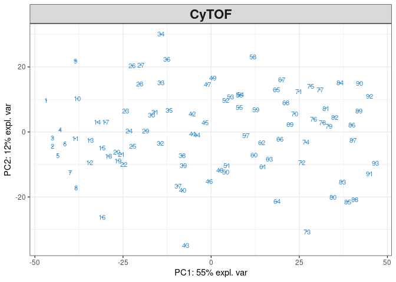
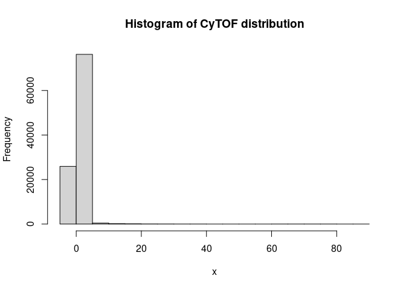
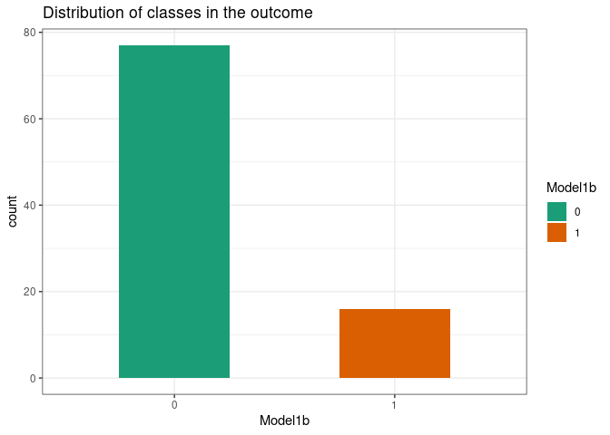
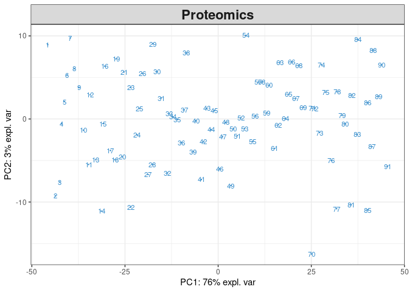
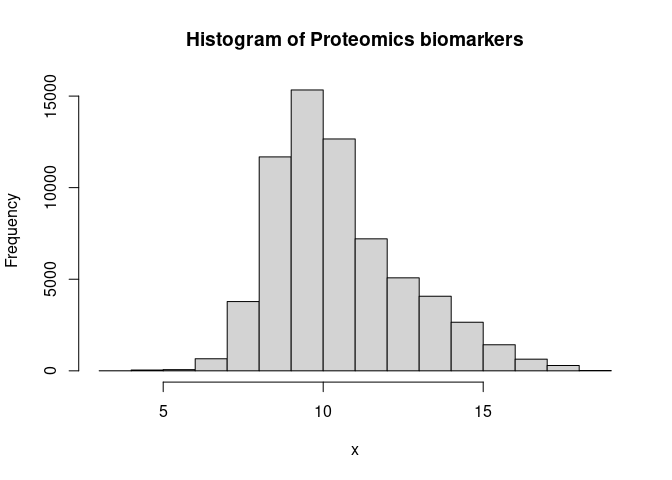

Curation of biobank ssi from Stabl
================
15 April, 2024

This curates the biobank ssi data from
[Stabl](https://github.com/gregbellan/Stabl/tree/main)

Surgical Site Infections (SSI)

Training

- Outcome: Control (`77`) Vs. SSI (`16`)
- CyTOF: `93` samples — `1125` biomarkers
- Proteomics: `91` samples — `721` biomarkers

``` r
# Load libraries
library(here)
library(tidyverse)
library(MultiAssayExperiment)
library(mixOmics)
# Custom functions to use
plot_pca <- function(df, title=NULL, ...) {
  if (is.null(title)) stop("Need to supply title")
  pcs <- pca(df) 
  plotIndiv(pcs, title=title, ...)
}

plot_hist <- function(df, ...) {
  x <- df %>% 
    select_if(is.numeric) %>%
    as.matrix()
  
  # Plot it
  hist(x=x, ...)
}

plot_response_dist <- function(df, y_col, width=0.5, palette="Dark2", ...) {
  df |> 
  mutate({{y_col}} := factor({{y_col}})) %>%
  ggplot(aes(x = {{y_col}}, fill={{y_col}}), ...) +
  geom_bar(width = width) +
  labs(...) +
  scale_fill_brewer(palette = palette) +
  theme_bw()
}


# Parameters to use
data_dir <- here("curation_data/stabl/stabl_data/biobank_ssi")
cytof_path <- here(data_dir, "CyTOF.csv")
proteomics_path <- here(data_dir, "Proteomics.csv")
outcome_path <- here(data_dir, "outcome.csv")
```

Then, we could first load the data and inspect each of them

``` r
# Loading the data
cytof <- read_csv(cytof_path)
proteomics <- read_csv(proteomics_path)
outcome <- read_csv(outcome_path)
```

Cytof looks like this

``` r
# First 6 rows are like
head(cytof)
```

    ## # A tibble: 6 × 1,126
    ##   sampleID   unstim_Baso_149Sm_CREB unstim_Baso_150Nd_ST…¹ unstim_Baso_151Eu_p38
    ##   <chr>                       <dbl>                  <dbl>                 <dbl>
    ## 1 BBCR0002                    0.633                  0.344                0.0281
    ## 2 BBCR0003                    0.922                  0.678                0.0412
    ## 3 BBCR0005-1                  0.570                  0.343                0     
    ## 4 BBCR0006                    0.784                  0.542                0.0138
    ## 5 BBCR0007                    0.915                  0.472                0.0941
    ## 6 BBCR0018-1                  0.554                  0.503                0     
    ## # ℹ abbreviated name: ¹​unstim_Baso_150Nd_STAT5
    ## # ℹ 1,122 more variables: unstim_Baso_153Eu_STAT1 <dbl>,
    ## #   unstim_Baso_154Sm_STAT3 <dbl>, unstim_Baso_155Gd_S6 <dbl>,
    ## #   unstim_Baso_159Tb_MAPKAPK2 <dbl>, unstim_Baso_164Dy_IkB <dbl>,
    ## #   unstim_Baso_166Er_NFkB <dbl>, unstim_Baso_167Er_ERK <dbl>,
    ## #   unstim_Baso_168Er_pSTAT6 <dbl>, unstim_Bcells_149Sm_CREB <dbl>,
    ## #   unstim_Bcells_150Nd_STAT5 <dbl>, unstim_Bcells_151Eu_p38 <dbl>, …

Then, we could perform pca on the data to see if any outlier, and plot
histogram to check overall distribution of all the numeric variables

``` r
# Check outlier
plot_pca(cytof, title="CyTOF")
```

<!-- -->

``` r
plot_hist(cytof, main="Histogram of CyTOF distribution")
```

<!-- -->

Outcome looks like this

``` r
# First 6 rows
head(outcome)
```

    ## # A tibble: 6 × 2
    ##   sampleID   model1b
    ##   <chr>        <dbl>
    ## 1 BBCR0002         1
    ## 2 BBCR0003         0
    ## 3 BBCR0005-1       0
    ## 4 BBCR0006         0
    ## 5 BBCR0007         0
    ## 6 BBCR0018-1       0

``` r
head(outcome) |> summary()
```

    ##    sampleID            model1b      
    ##  Length:6           Min.   :0.0000  
    ##  Class :character   1st Qu.:0.0000  
    ##  Mode  :character   Median :0.0000  
    ##                     Mean   :0.1667  
    ##                     3rd Qu.:0.0000  
    ##                     Max.   :1.0000

Then, count distribution of classes in the outcome

``` r
# Plot the distribution of classes in the outcome
plot_response_dist(outcome, model1b, x="Model1b", fill = "Model1b",
                   title="Distribution of classes in the outcome")
```

<!-- -->

summary of proteomics

``` r
# Show first 6 rows
head(proteomics)
```

    ## # A tibble: 6 × 722
    ##   sampleID   CRYBB2   VDR DUSP4 WNT10A  NCF2 FOXM1 PLCG2  BAG3   CBS CRYAA   JUN
    ##   <chr>       <dbl> <dbl> <dbl>  <dbl> <dbl> <dbl> <dbl> <dbl> <dbl> <dbl> <dbl>
    ## 1 BBCR0002     9.06  9.33  9.17  10.1   8.92  9.05  9.35  9.66  10.1  8.41  10.6
    ## 2 BBCR0003     9.00  8.97  9.02   9.63  8.55 10.1   9.72  9.21  10.3  8.26  10.2
    ## 3 BBCR0005-1   8.80  9.05  9.08   9.17  8.71 10.1  10.3   9.31  11.1  8.27  10.1
    ## 4 BBCR0006     9.06  9.08  8.97   9.16  8.64 10.1   9.59  9.23  10.9  8.37  10.4
    ## 5 BBCR0007     9.02  9.19  9.16   9.93  8.75  9.30  9.56  9.36  10.2  8.38  10.5
    ## 6 BBCR0018-1   9.11  9.33  9.15  10.2   8.80  9.78  9.35  9.40  10.2  8.62  10.8
    ## # ℹ 710 more variables: OAS1 <dbl>, MYC <dbl>, SMAD3 <dbl>,
    ## #   `IL12B|IL23A` <dbl>, PDGFRA <dbl>, `IL12A|IL12B` <dbl>, STAT6 <dbl>,
    ## #   B4GALT5 <dbl>, CSF2RA <dbl>, NUCB1 <dbl>, IL31 <dbl>, NRAS <dbl>,
    ## #   KLRC4 <dbl>, GLB1 <dbl>, ACE <dbl>, CD58 <dbl>, TLR4 <dbl>, HSPB1 <dbl>,
    ## #   ENO1 <dbl>, TENM3 <dbl>, CLEC12A <dbl>, HNF1A <dbl>, CXADR <dbl>,
    ## #   TBCE <dbl>, TXNDC5 <dbl>, TPMT <dbl>, ALDH1A1 <dbl>, ATF6 <dbl>,
    ## #   LAIR1 <dbl>, NT5C2 <dbl>, SAMHD1 <dbl>, RAG1 <dbl>, MRE11 <dbl>, …

Proteomics has one identifier column sampleID, where rest are numeric.
So, we could see overall distribution of these biomarker variables.

``` r
# PCA on it to see if any noticeable outlier
plot_pca(proteomics, title = "Proteomics", )
```

<!-- -->

``` r
# Histogram to see overal distributions of values of each biomarker
plot_hist(proteomics, main="Histogram of Proteomics biomarkers")
```

<!-- -->
